# Music Enthusiast 🎵

Music Enthusiast is a feature-rich web application for music lovers to explore, create, and share playlists. It enables users to manage accounts, search for music, interact with playlists, and engage with reviews — all through a sleek and responsive interface.


# Features

- **Account Management**

  - Register an account
  - Login and Logout
  - Change password

- **Music Discovery**

  - Search for music by name, artist, or genre
  - View detailed information about tracks

- **Playlist Management**

  - Create your own playlists
  - View and explore playlists created by others
  - View playlist details

- **Social Features**
  - Write reviews for playlists
  - View reviews written by other users

## Tech Stack

- **Frontend**: React, JavaScript, CSS
- **Backend**: Node.js, Express
- **Database**: Local database

## Key Highlights

- Engineered a RESTful API using Node.js and Express for music data retrieval.
- Integrated a responsive React frontend for an intuitive user experience.
- Implemented HTTP caching headers and in-memory caching mechanisms, reducing API latency by 60%.
- Optimized state management techniques for enhanced scalability and fault tolerance.

## Setup Instructions

## Prerequisites

Ensure you have the following installed:

- Node.js
- npm

## Installation

1. Clone the repository:
   ```bash
   git clone https://github.com/yourusername/Music-Enthusiast.git
   cd music-enthusiast
   ```
2. Install client dependencies
   ```bash
   cd client
   npm i
   ```
3. Install server dependencies
   ```bash
   cd server
   npm i
   ```
4. Run the client
   ```bash
   cd client
   npm start
   ```
5. Run the server
   ```bash
   cd server
   nodemon server
   ```

# Screenshots

## Homepage


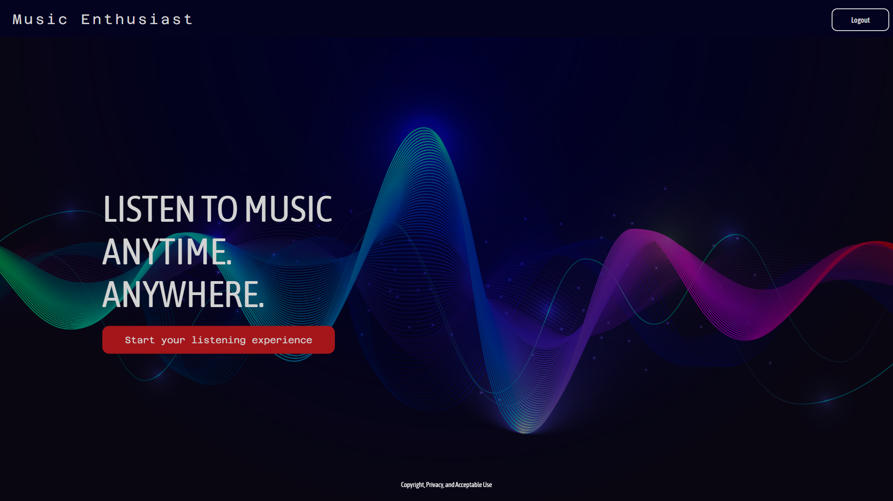

## Authentication

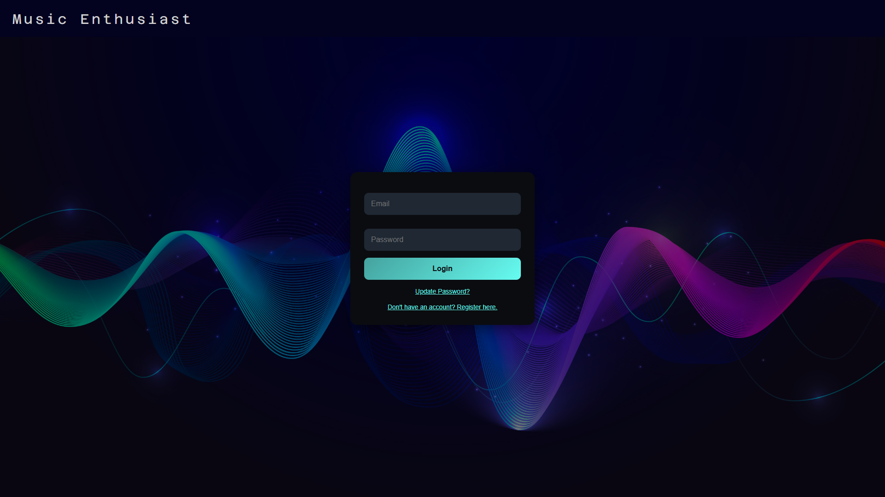
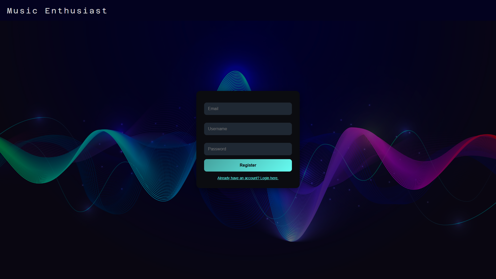
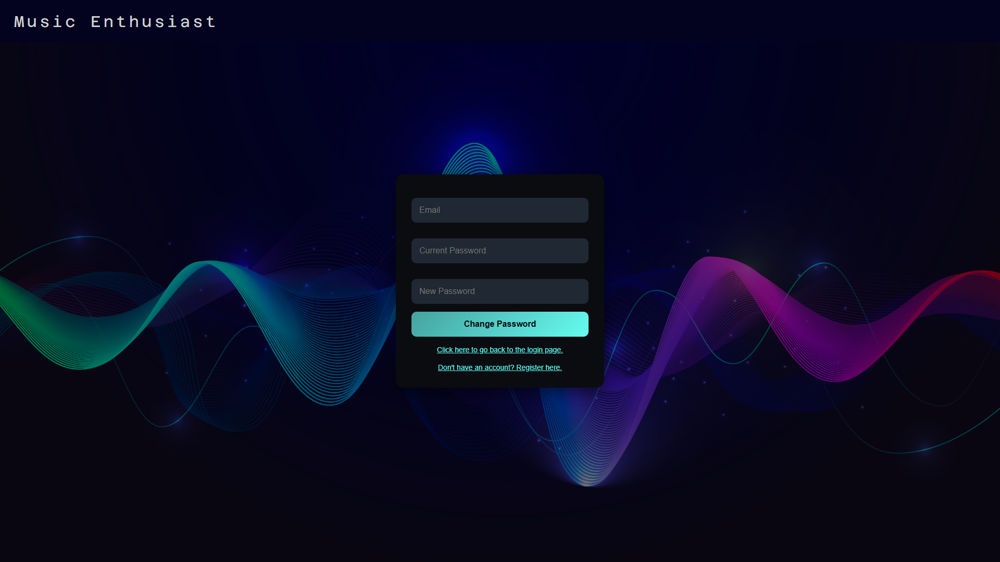

## Features

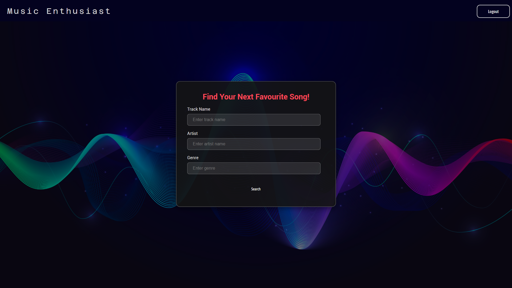
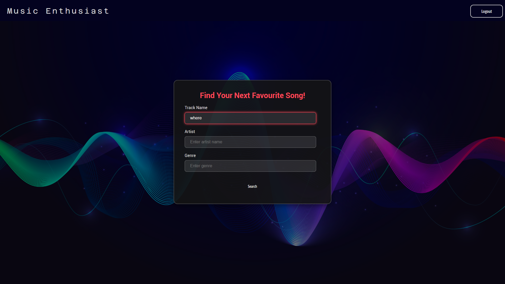
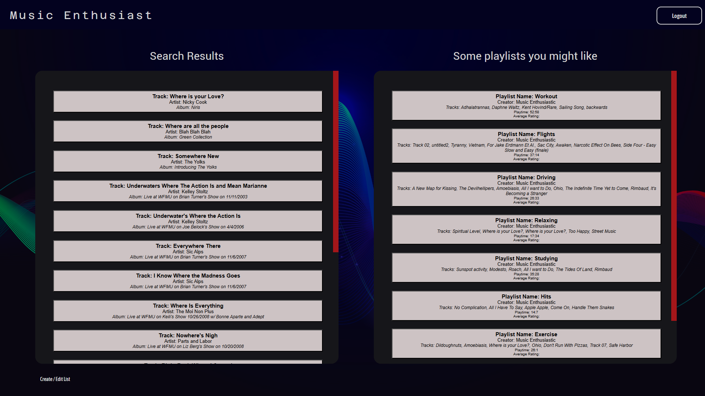
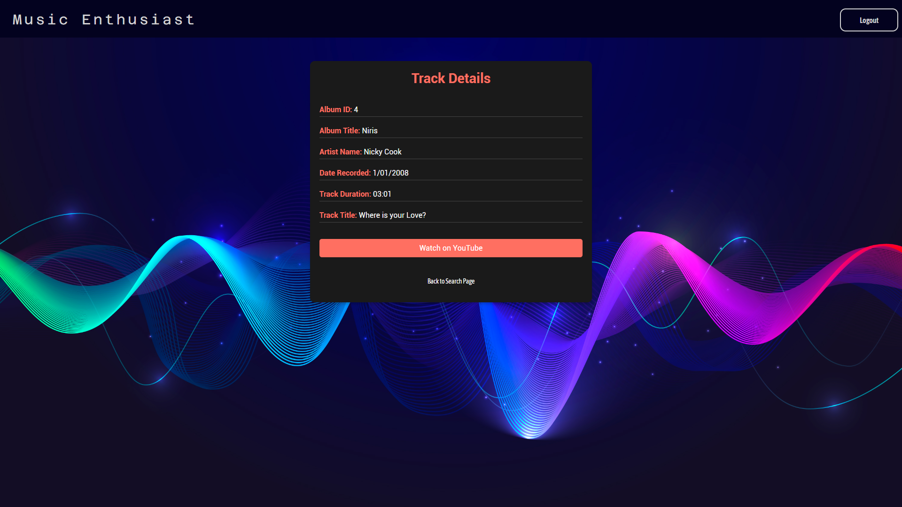
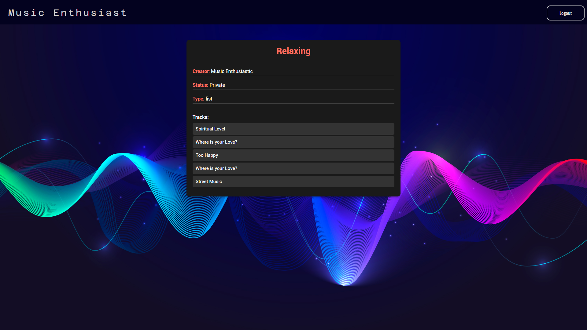
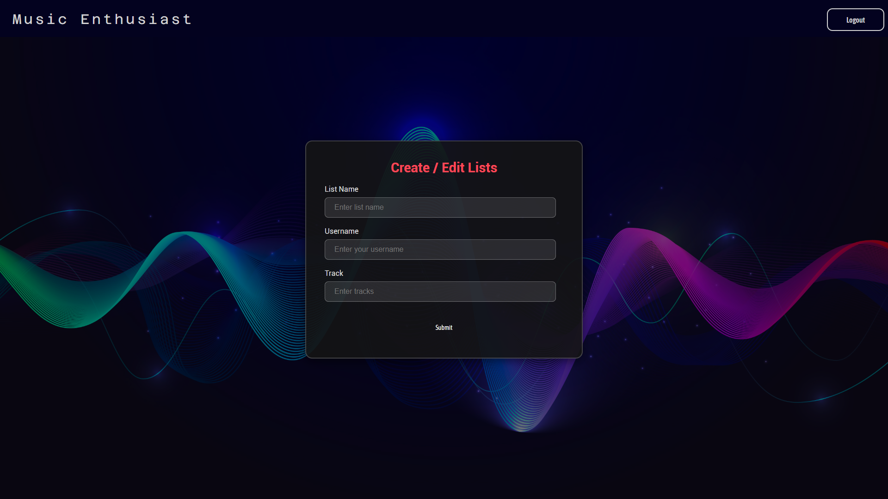
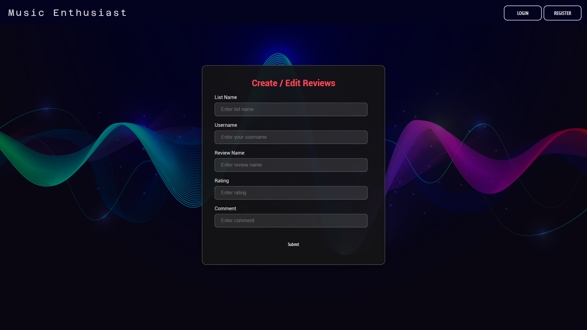
